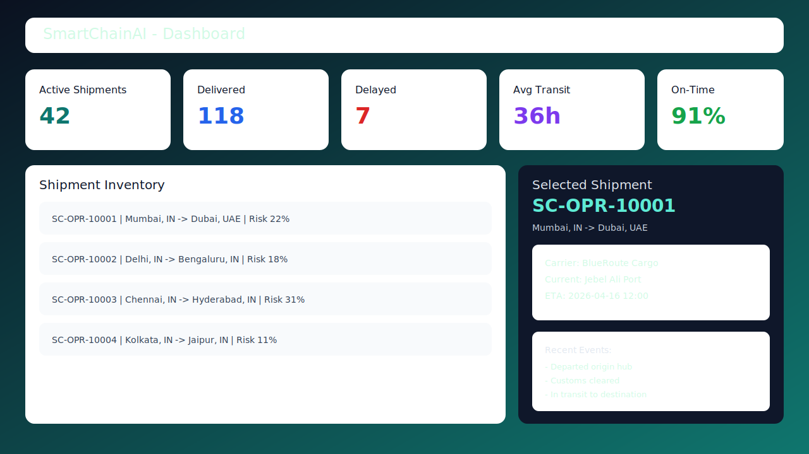
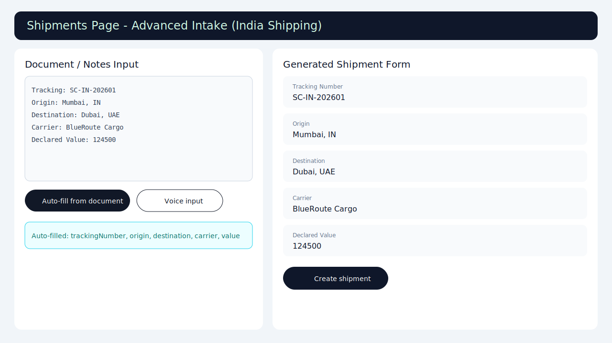
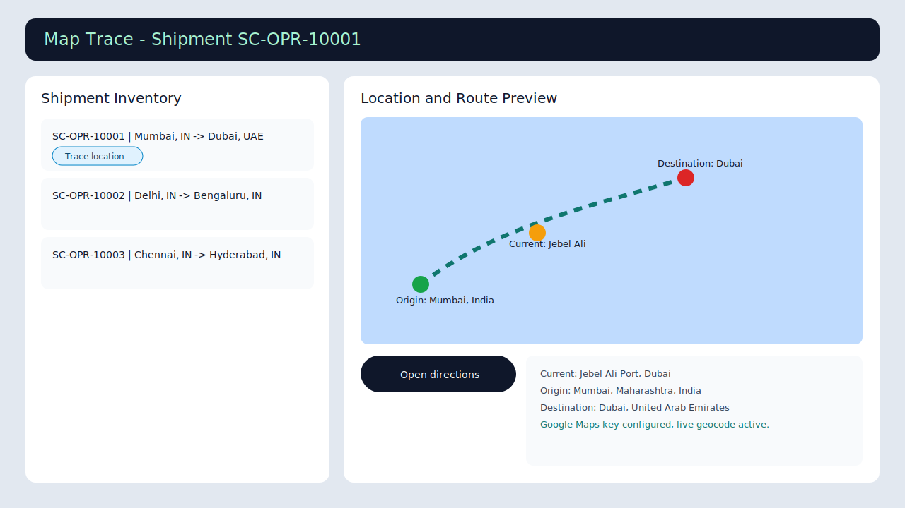
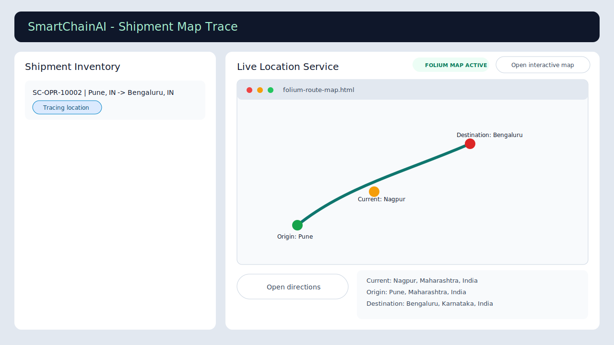
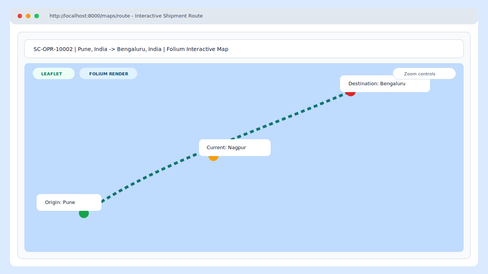
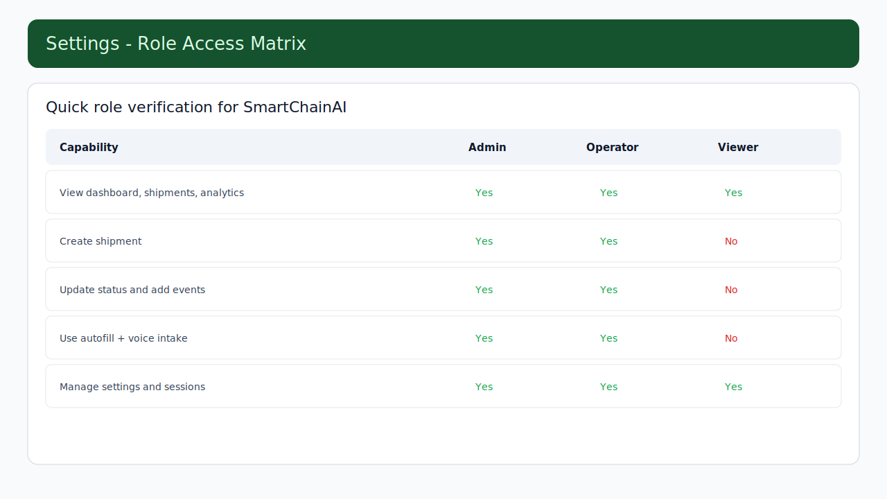

# SmartChainAI

SmartChainAI is an end-to-end logistics intelligence platform that combines real-time shipment operations, API-driven analytics, and AI forecasting into one production-ready stack.

## Why SmartChainAI

- Live shipment visibility across operations flows
- Risk-aware delivery insights and delay scoring
- Demand forecasting support through a dedicated AI service
- Full-stack architecture for local development and container deployment

## SmartChainAI vs Existing Approaches

| Area | Existing Logistics Tools | SmartChainAI |
|---|---|---|
| Tracking | Mostly status-only timelines | Real-time tracking with analytics context |
| Risk Insights | Reactive alerts after delay | Proactive delay risk scoring and expected delay prediction |
| Forecasting | External spreadsheets/manual planning | Built-in AI forecasting service via API |
| Architecture | Siloed dashboard + separate services | Unified frontend, backend, AI microservice architecture |
| Developer Experience | Hard to run locally end-to-end | One repo with quick-start scripts, Docker, and tests |
| Data Validation | Limited visibility into data quality | Dataset attachment checks and automated test coverage |

This makes SmartChainAI suitable for teams that need both operational monitoring and decision intelligence in a single platform.

## Core Capabilities

- Secure JWT authentication and protected APIs
- Shipment, analytics, and location endpoints in the backend
- Interactive React dashboard with tracking and map views
- FastAPI AI microservice for prediction and forecasting workloads
- Automated tests across frontend, backend, and AI modules

## Tech Stack

- Frontend: React, Vite, Tailwind CSS
- Backend: Node.js, Express, TypeScript, MongoDB, Joi
- AI Service: FastAPI, Pydantic, Python
- Tooling: Jest, Pytest, Docker, npm workspaces

## Project Structure

```text
SmartChainAI/
├── frontend/                     # React dashboard (tracking, analytics, maps)
├── backend/                      # Express API, auth, validation, business logic
├── ai-service/                   # FastAPI prediction and forecasting service
├── datasets/                     # Kaggle datasets used by project workflows
│   ├── olistbr_brazilian-ecommerce/
│   └── ziya07_smart-logistics-supply-chain-dataset/
├── tests/                        # Test suites (frontend, backend, ai)
├── docs/                         # API and architecture docs
├── scripts/                      # Local orchestration and utility scripts
├── docker-compose.yml            # Multi-service local container setup
└── README.md
```

## Quick Start

1. Copy environment configuration.

```bash
cp .env.example .env
```

2. Use Node 20.

```bash
nvm use
```

3. Install monorepo dependencies.

```bash
npm install
```

4. Start backend and frontend.

```bash
npm run dev:backend
npm run dev:frontend
```

5. Run AI service in another terminal.

```bash
cd ai-service
python3 -m venv .venv
source .venv/bin/activate
python -m pip install -r requirements.txt
uvicorn app.main:app --reload --host 0.0.0.0 --port 8000
```

## Helpful Commands

```bash
npm run lint
npm run build
npm run test
npm run dev:all-local
```

Reset demo data:

```bash
npm run seed:demo --workspace backend -- --reset
```

Launch with Docker:

```bash
docker compose up --build
```

## Location Service

- GET /api/location/geocode?address=<address>
- GET /api/location/shipments/:id

The frontend consumes these endpoints to render shipment location cards and map context.

## Datasets

Attached Kaggle datasets in datasets:

- olistbr/brazilian-ecommerce -> datasets/olistbr_brazilian-ecommerce
- ziya07/smart-logistics-supply-chain-dataset -> datasets/ziya07_smart-logistics-supply-chain-dataset

Validate dataset attachment:

```bash
python -m pytest tests/ai/test_datasets_attachment.py
```

Service export text files for shipment autofill upload:

- [export-india-air-priority.txt](docs/service-exports/export-india-air-priority.txt)
- [export-india-port-crossdock.txt](docs/service-exports/export-india-port-crossdock.txt)
- [export-india-gulf-lane.txt](docs/service-exports/export-india-gulf-lane.txt)

## Documentation

- [API.md](docs/API.md)
- [ARCHITECTURE.md](docs/ARCHITECTURE.md)
- [PROJECT_VISUALS.md](docs/PROJECT_VISUALS.md)

## Screenshots

Dashboard overview



Shipments autofill workflow



Location trace and map preview



Folium map active in shipment card



Folium interactive route opened in new tab



Role access matrix in settings

