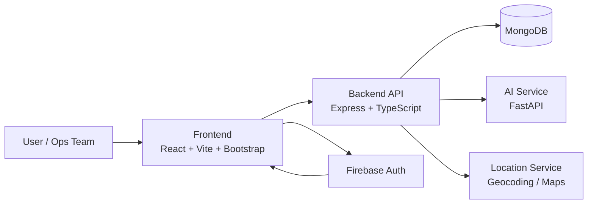
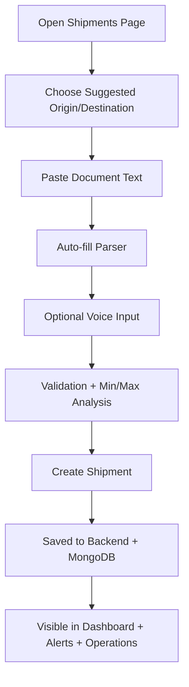
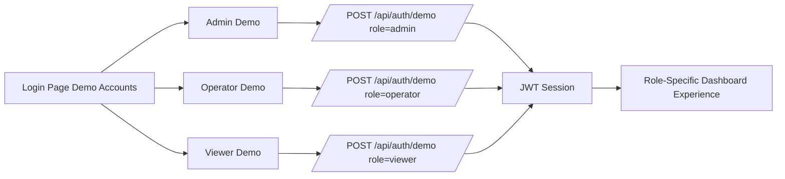
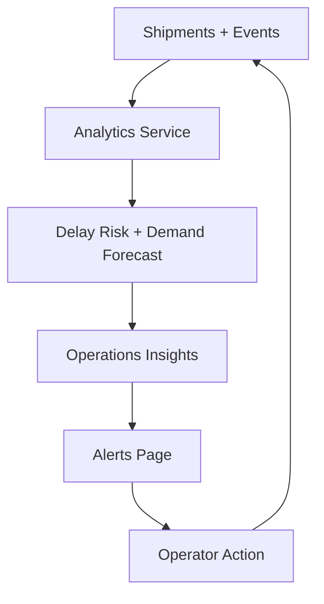

# SmartChainAI Visual Output Guide

This document provides visual-style output diagrams that explain how SmartChainAI works end-to-end.

## 1. System Architecture

## 2. Shipment Intake UX Flow

## 3. Role-Based Demo Connectivity

## 4. Analytics and Alerting Loop

## 5. What To Screenshot For Reporting

- Entry page with SmartChainAI hero and account status.
- Login page showing Admin/Operator/Viewer demo account cards.
- Shipments page with:
  - route suggestions
  - document auto-fill
  - voice input button
  - min/max analysis cards
- Operations page with backlog, top carriers, and high-risk shipments.
- Alerts page with severity-grouped recommendations.
- Settings page with role-aware session and preferences.
